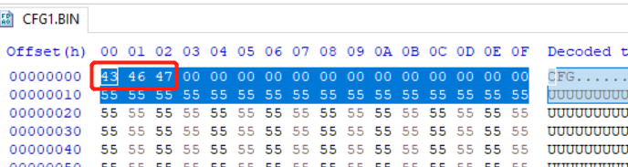

# K32L2B MSD bootloader

The project is derivate from ARM daplink open source project, The original ARMmbed bootloader code is well tested on serval hardware and proven to be very stable.

https://github.com/ARMmbed/DAPLink

| Folder       | Description                         |
| ------------ | ----------------------------------- |
| example_app  | Example application start at 0x8000 |
| projectfiles | bootloader Keil project             |
| source       | bootloader source code              |

# How To Use

1. Open **\k32l2b_msd_bootloader\projectfiles\uvision\k32l2b_bl**  Keil project, compile and download to FRDM-K32L2B board.
2. Plug USB cable to J101(K32L2B USB). 
3. Hold SW3, then press RESET(SW2) , this let MCU enter MSD bootloader mode. the MSD disk will be pop up.
4. Drag frdm_**k32l2b_fast_0x8000.bin** or frdm**_k32l2b_slow_0x8000.bin** under example_app folder to update image.

20200527：

New feature: firmware can be shown when enter MSD boot loader mode. there will be a file called "FW_DATA.BIN" which is the content of last programmed image(started at 0x0000_8000).

20200604:

**IMAGE DISPLAY**: there are two images show in DISK:

 FW_DATA.BIN and  CF_DATA.BIN.

* FW_DATA.BIN will show the flash data start at 0x0008000

* CF_DATA.BIN will show the flash data start at 0x00016000

**DATA PROGRAMMING:**

* drag any valid K32l2b image(any file name) will programming at 0x8000.

* drag config data will programming at 0x00016000

config data:

config data is defined as the first 3 byte of file must be 'C', 'F', 'G'. as in the example_app folder shows:

